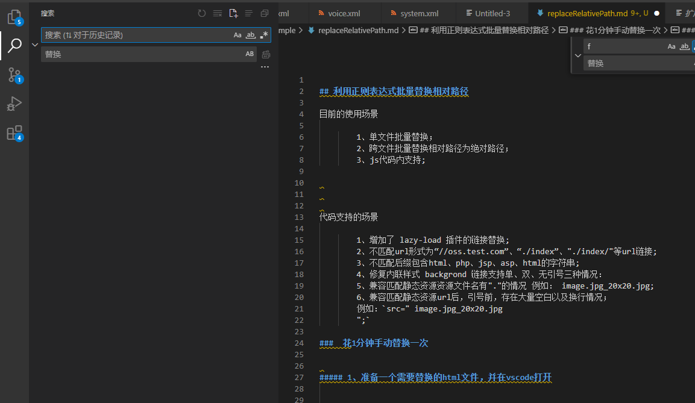
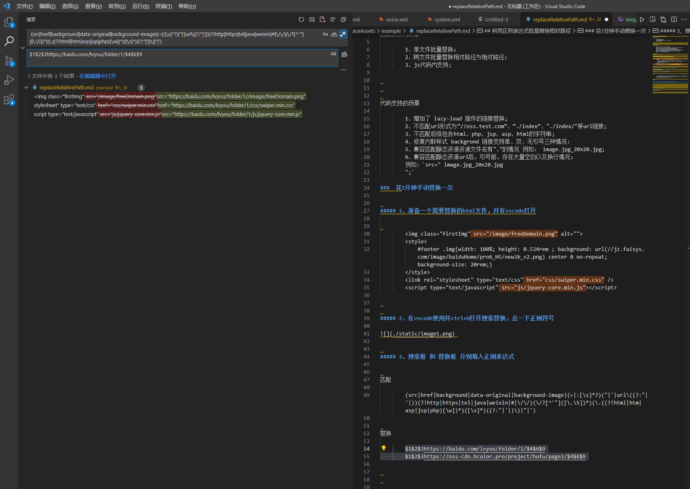

## 利用正则表达式批量替换相对路径

目前的使用场景

        1、单文件批量替换；
        2、跨文件批量替换相对路径为绝对路径；
        3、js代码内支持;

代码支持的场景

        1、增加了 lazy-load 插件的链接替换;
        2、不匹配url形式为“//oss.test.com”、“./index”、"./index/"等url链接;
        3、不匹配后缀包含html、php、jsp、asp、html的字符串;
        4、修复内联样式 backgrond 链接支持单、双、无引号三种情况：
        5、兼容匹配静态资源资源文件名有"."的情况 例如： image.jpg_20x20.jpg;
        6、兼容匹配静态资源url后，引号前，存在大量空白以及换行情况； 
        例如：`src=" image.jpg_20x20.jpg
        ";`

###  花1分钟手动替换一次

##### 1、准备一个需要替换的html文件，并在vscode打开

        
        
        <link rel="stylesheet" type="text/css" href="css/swiper.min.css" />
        

##### 2、在vscode使用并ctrl+H打开搜索替换，点一下正则符号

 

##### 3、搜索框 和 替换框 分别填入正则表达式

匹配

        (src|href|background|data-original|background-image)(=|:[\s]*?)("|'|url\((?:"|'|))(?!http|https|tel|java|weixin|#|\/\/)(\/?[^'"]([\.\S])*)(\.((?!html|htm|asp|jsp|php)[\w])*)([\s]*)((?:"|'|)\)|"|')

替换

        $1$2$3https://baidu.com/lvyou/folder/1/$4$6$9
        $1$2$3https://oss-cdn.hcolor.pro/project/hufu/page2/$4$6$9

 

##### 4、点击批量替换；

##### 5、正则解析

